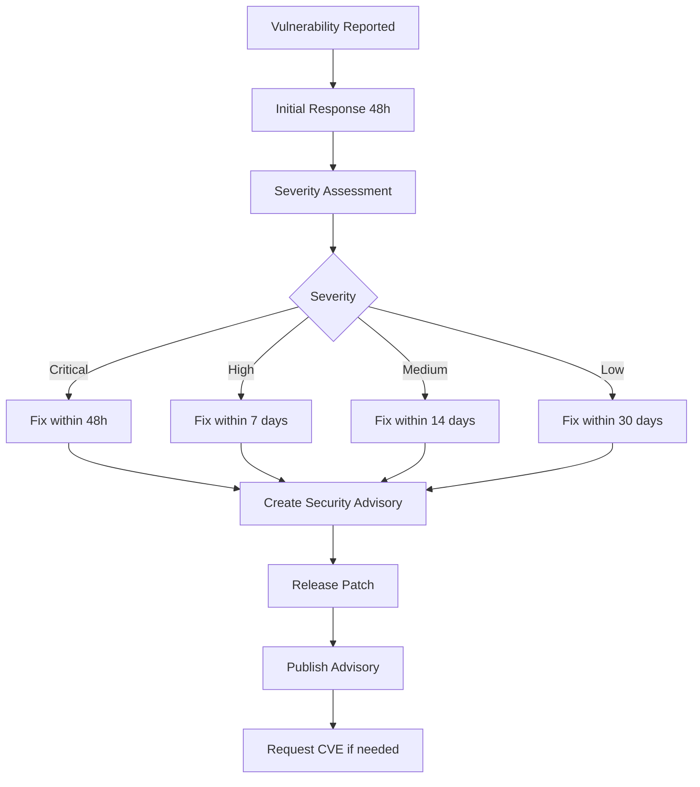

# ADR-0015: Security Policy

## Status
Accepted

## Context
A clear security policy is essential for:
- **Vulnerability disclosure**: Responsible reporting and handling of security issues
- **User trust**: Demonstrating commitment to security
- **Enterprise adoption**: Organizations require clear security policies
- **Galaxy requirements**: Ansible Galaxy recommends security policies
- **Community safety**: Protecting users from known vulnerabilities

Security considerations:
- **Disclosure process**: How to report vulnerabilities privately
- **Response timeline**: How quickly security issues are addressed
- **Supported versions**: Which versions receive security updates
- **Dependency management**: Keeping dependencies up-to-date and secure
- **Security scanning**: Automated detection of vulnerabilities
- **Transparency**: Public security advisories for fixed vulnerabilities

Industry standards from successful projects:
- **GitHub Security Advisories**: Standard platform for security disclosures
- **Dependabot**: Automated dependency updates
- **SECURITY.md**: Standard file for security policies
- **CVE process**: Common Vulnerabilities and Exposures registration

## Decision
We will implement a **comprehensive security policy** with responsible disclosure, automated scanning, and clear response timelines:

### 1. SECURITY.md File

Create `SECURITY.md` in repository root:

```markdown
# Security Policy

## Supported Versions

We provide security updates for the following versions:

| Version | Supported          | End of Support |
| ------- | ------------------ | -------------- |
| 1.x.x   | :white_check_mark: | TBD            |
| < 1.0   | :x:                | 2024-01-01     |

**Policy**: We support the latest major version and the previous major version for 12 months after a new major version is released.

## Reporting a Vulnerability

**Please do NOT report security vulnerabilities through public GitHub issues.**

Instead, please report security vulnerabilities using one of these methods:

### GitHub Private Vulnerability Reporting (Preferred)
1. Go to the [Security tab](https://github.com/tosin2013/ansible-collection-mcp-audit/security)
2. Click "Report a vulnerability"
3. Fill out the form with details

### Email
If you prefer email, send to: **tosin.akinosho@gmail.com**
- Subject line: `[SECURITY] MCP Audit Collection: [Brief Description]`
- Include:
  - Description of the vulnerability
  - Steps to reproduce
  - Potential impact
  - Suggested fix (if any)

### What to Expect
- **Initial Response**: Within 48 hours
- **Status Update**: Within 5 business days
- **Fix Timeline**:
  - Critical: Within 7 days
  - High: Within 14 days
  - Medium: Within 30 days
  - Low: Next regular release

### Disclosure Process
1. **Private Discussion**: We'll work with you privately to understand and fix the issue
2. **Fix Development**: We'll develop a fix and test it
3. **Advisory Creation**: We'll create a GitHub Security Advisory
4. **Coordinated Release**: We'll release the fix and publish the advisory
5. **CVE Assignment**: For significant vulnerabilities, we'll request a CVE

### Recognition
- We'll credit you in the security advisory (unless you prefer to remain anonymous)
- Your name will be added to our CONTRIBUTORS file

### Bug Bounty
Currently, we do not offer a paid bug bounty program. This is an open-source project maintained by volunteers.

## Security Best Practices for Users

### Installation
```bash
# Always verify the collection before installation
ansible-galaxy collection install mcp.audit --force

# Check the installed version
ansible-galaxy collection list | grep mcp.audit
```

### Usage
- **Principle of Least Privilege**: Run playbooks with minimum required permissions
- **Input Validation**: Always validate user-supplied inputs to modules
- **Secrets Management**: Use Ansible Vault for sensitive data
- **Regular Updates**: Keep the collection updated to the latest version

```yaml
# Use Ansible Vault for sensitive data
- name: Test MCP server with credentials
  mcp.audit.mcp_server_info:
    url: https://mcp.example.com
    auth_token: "{{ vault_mcp_token }}"
```

## Security Features

### Built-in Security
- **No Privileged Operations**: Modules do not require root/sudo
- **SELinux Compatible**: Works with SELinux in enforcing mode
- **Input Sanitization**: All inputs are validated and sanitized
- **Secure Defaults**: Secure defaults for all parameters
- **Timeout Protection**: Configurable timeouts prevent hanging

### Dependency Security
- **Regular Scans**: Dependabot scans dependencies weekly
- **Minimal Dependencies**: Only essential dependencies included
- **Version Pinning**: Dependencies pinned to secure versions

## Known Security Limitations

### Limitations
1. **Server Trust**: Modules trust the MCP server they connect to. Use only trusted servers.
2. **Command Injection Risk**: When using `server_command` parameter, ensure the command is from a trusted source.
3. **Network Security**: When using HTTP/SSE transports, use HTTPS and verify certificates.

### Mitigations
```yaml
# Example: Secure MCP server testing
- name: Test MCP server securely
  mcp.audit.mcp_server_info:
    transport: http
    url: https://mcp.example.com  # Always use HTTPS
    verify_ssl: true               # Verify SSL certificates
    timeout: 30                    # Set reasonable timeout
```

## Security Updates

### Update Notifications
- **GitHub Watch**: Star/watch the repository for security updates
- **GitHub Security Advisories**: Subscribe to advisories
- **Ansible Galaxy**: Collection updates shown on Galaxy page
- **RSS Feed**: Subscribe to release RSS feed

### Update Process
```bash
# Check for updates
ansible-galaxy collection list mcp.audit

# Update to latest version
ansible-galaxy collection install mcp.audit --force

# Review changelog for security fixes
cat ~/.ansible/collections/ansible_collections/mcp/audit/CHANGELOG.rst
```

## Third-Party Dependencies

### Current Dependencies
- **MCP Python SDK** (>= 1.19.0): Official MCP SDK
- **ansible-core** (>= 2.15.0): Ansible automation platform

### Dependency Monitoring
- Dependabot: Automated dependency updates
- Weekly scans for new vulnerabilities
- Immediate updates for critical vulnerabilities

## Security Scanning

### Automated Scans
- **CodeQL**: Weekly code security analysis
- **Dependabot**: Daily dependency vulnerability checks
- **TruffleHog**: Secret scanning on every commit
- **ansible-test**: Security-focused sanity tests

### Manual Reviews
- Security review for all PRs touching security-sensitive code
- Annual comprehensive security audit
- Penetration testing before major releases

## Contact

- **Security Issues**: tosin.akinosho@gmail.com (private)
- **General Questions**: [GitHub Discussions](https://github.com/tosin2013/ansible-collection-mcp-audit/discussions)
- **Maintainer**: @tosin2013

---

**Last Updated**: 2025-01-15
**Version**: 1.0
```

### 2. GitHub Security Features Configuration

#### Enable GitHub Security Features
```yaml
# .github/dependabot.yml
---
version: 2
updates:
  # Python dependencies
  - package-ecosystem: "pip"
    directory: "/"
    schedule:
      interval: "weekly"
    open-pull-requests-limit: 5
    reviewers:
      - "tosin2013"
    labels:
      - "dependencies"
      - "security"
    commit-message:
      prefix: "security"
      include: "scope"

  # GitHub Actions
  - package-ecosystem: "github-actions"
    directory: "/"
    schedule:
      interval: "weekly"
    reviewers:
      - "tosin2013"
    labels:
      - "dependencies"
      - "github-actions"
```

#### Security Scanning Workflow (Integrated in ADR-0012)
```yaml
# .github/workflows/security.yml
name: Security
on:
  push:
    branches: [main]
  pull_request:
    branches: [main]
  schedule:
    - cron: '0 0 * * 0'  # Weekly on Sunday

jobs:
  codeql:
    runs-on: ubuntu-latest
    permissions:
      security-events: write
    steps:
      - uses: actions/checkout@v4
      - uses: github/codeql-action/init@v3
        with:
          languages: python
      - uses: github/codeql-action/autobuild@v3
      - uses: github/codeql-action/analyze@v3

  dependency-review:
    runs-on: ubuntu-latest
    if: github.event_name == 'pull_request'
    steps:
      - uses: actions/checkout@v4
      - uses: actions/dependency-review-action@v4

  secret-scan:
    runs-on: ubuntu-latest
    steps:
      - uses: actions/checkout@v4
        with:
          fetch-depth: 0
      - uses: trufflesecurity/trufflehog@main
        with:
          extra_args: --only-verified
```

### 3. Security Response Process

#### Vulnerability Severity Classification
| Severity | Description | Response Time | Examples |
|----------|-------------|---------------|----------|
| **Critical** | Remote code execution, privilege escalation | 48 hours | Command injection, arbitrary file write |
| **High** | Data exposure, authentication bypass | 7 days | Secrets in logs, improper access control |
| **Medium** | Denial of service, information disclosure | 14 days | Resource exhaustion, stack traces in output |
| **Low** | Minor information leakage | 30 days | Version disclosure, verbose error messages |

#### Response Workflow


### 4. Security Advisory Template

```markdown
## Security Advisory: [GHSA-xxxx-xxxx-xxxx]

### Summary
[Brief description of the vulnerability]

### Severity
**Severity**: [Critical/High/Medium/Low]
**CVSS Score**: [X.X]

### Affected Versions
- mcp.audit < X.Y.Z

### Patched Versions
- mcp.audit >= X.Y.Z

### Impact
[Detailed description of the impact]

### Workarounds
[If temporary workarounds exist]

### References
- Fix PR: #XXX
- CVE: CVE-XXXX-XXXXX (if assigned)

### Credits
Reported by: [Reporter Name] (@github-handle)

### Timeline
- YYYY-MM-DD: Vulnerability reported
- YYYY-MM-DD: Fix developed
- YYYY-MM-DD: Patch released
- YYYY-MM-DD: Advisory published
```

### 5. Dependency Management Policy

#### Update Schedule
- **Critical vulnerabilities**: Immediate (within 24 hours)
- **High vulnerabilities**: Within 7 days
- **Medium vulnerabilities**: Next minor release
- **Low vulnerabilities**: Next minor release
- **No vulnerabilities**: Quarterly dependency updates

#### Automated Updates (Dependabot)
```yaml
# Auto-merge for patch updates
name: Dependabot Auto-Merge
on: pull_request

jobs:
  auto-merge:
    runs-on: ubuntu-latest
    if: github.actor == 'dependabot[bot]'
    steps:
      - uses: actions/checkout@v4
      - uses: dependabot/fetch-metadata@v1
        id: metadata
      - name: Auto-merge patch updates
        if: steps.metadata.outputs.update-type == 'version-update:semver-patch'
        run: gh pr merge --auto --squash "$PR_URL"
        env:
          PR_URL: ${{github.event.pull_request.html_url}}
          GH_TOKEN: ${{secrets.GITHUB_TOKEN}}
```

### 6. Secure Coding Guidelines

#### Input Validation
```python
# plugins/module_utils/mcp_validator.py
def validate_server_command(command: str) -> bool:
    """Validate server command to prevent injection attacks."""
    # Whitelist allowed commands
    ALLOWED_COMMANDS = ['python', 'python3', 'node', 'npx']

    cmd_parts = shlex.split(command)
    if not cmd_parts:
        return False

    executable = os.path.basename(cmd_parts[0])
    return executable in ALLOWED_COMMANDS
```

#### Output Sanitization
```python
def sanitize_output(data: dict) -> dict:
    """Remove sensitive information from output."""
    SENSITIVE_KEYS = ['password', 'token', 'secret', 'api_key']

    for key in list(data.keys()):
        if any(sensitive in key.lower() for sensitive in SENSITIVE_KEYS):
            data[key] = '***REDACTED***'

    return data
```

## Consequences

### Positive
- **Clear process**: Defined vulnerability disclosure and response process
- **User trust**: Demonstrates commitment to security
- **Automated scanning**: Multiple layers of security scanning
- **Rapid response**: Clear timelines for security fixes
- **Transparency**: Public security advisories build trust
- **Enterprise ready**: Meets enterprise security policy requirements
- **Community safety**: Protects users from vulnerabilities

### Negative
- **Maintenance overhead**: Security policies require ongoing attention
- **Response burden**: Must respond to reports within 48 hours
- **Dependency updates**: Frequent Dependabot PRs to review
- **False positives**: Security scanners may flag non-issues
- **Disclosure complexity**: Coordinated disclosure requires careful timing

### Neutral
- Security policy is standard for production software
- GitHub Security features are industry standard
- Dependabot is widely used and accepted

## Implementation Notes

### Initial Setup
```bash
# 1. Create SECURITY.md
cp [content above] SECURITY.md

# 2. Enable GitHub Security Features
# Repository Settings → Security → Configure

# 3. Enable Dependabot
cp [dependabot.yml content] .github/dependabot.yml

# 4. Add security workflow
cp [security.yml content] .github/workflows/security.yml

# 5. Enable Private Vulnerability Reporting
# Repository Settings → Security → Vulnerability reporting → Enable

# 6. Configure Security Advisories
# Repository Settings → Security → Advisories → Configure

# 7. Add security contact to README
echo "Security issues: tosin.akinosho@gmail.com" >> README.md
```

### Security Review Checklist
```markdown
## Security Review Checklist

### Code Changes
- [ ] Input validation for all user-supplied data
- [ ] Output sanitization for sensitive information
- [ ] No hardcoded secrets or credentials
- [ ] Secure defaults for all parameters
- [ ] Error messages don't leak sensitive info

### Dependencies
- [ ] All dependencies up-to-date
- [ ] No known vulnerabilities in dependencies
- [ ] Minimal dependencies (only what's needed)
- [ ] Dependencies from trusted sources

### Testing
- [ ] Security-focused test cases added
- [ ] Input fuzzing performed
- [ ] Error handling tested
- [ ] Timeout handling tested

### Documentation
- [ ] Security implications documented
- [ ] Secure usage examples provided
- [ ] Known limitations documented
```

## Alternatives Considered

### No Security Policy
- **Pros**: Less overhead
- **Cons**: Irresponsible, reduces trust, not Galaxy-ready
- **Verdict**: Rejected - security policy is essential

### Email-Only Disclosure
- **Pros**: Simple, private
- **Cons**: No tracking, no transparency, difficult to manage
- **Verdict**: Rejected - GitHub Security Advisories provide better workflow

### Public Issue Reporting
- **Pros**: Transparent, community involved
- **Cons**: Dangerous (exposes vulnerabilities before fix), irresponsible
- **Verdict**: Rejected - private disclosure is security best practice

### Paid Bug Bounty
- **Pros**: Incentivizes security research
- **Cons**: Expensive, requires funding, complex administration
- **Verdict**: Rejected for now - open-source project with volunteer maintainers, may revisit if project grows

### Stricter Response Times
- **Pros**: Faster fixes
- **Cons**: Unrealistic for volunteer-maintained project, leads to burnout
- **Verdict**: Rejected - current timelines are reasonable and achievable

## References

- [GitHub Security Features](https://docs.github.com/en/code-security)
- [Responsible Disclosure Guidelines](https://cheatsheetseries.owasp.org/cheatsheets/Vulnerability_Disclosure_Cheat_Sheet.html)
- [SECURITY.md Standard](https://docs.github.com/en/code-security/getting-started/adding-a-security-policy-to-your-repository)
- [Dependabot Documentation](https://docs.github.com/en/code-security/dependabot)
- [CodeQL Documentation](https://codeql.github.com/docs/)
- [CVE Process](https://www.cve.org/ResourcesSupport/AllResources/CNARules)

## Review and Update Schedule
- **Quarterly**: Review security policy effectiveness
- **On security incident**: Update policy based on lessons learned
- **Annually**: Comprehensive security audit
- **On new security tools**: Evaluate and integrate if beneficial
- **Per major release**: Security-focused testing and review
